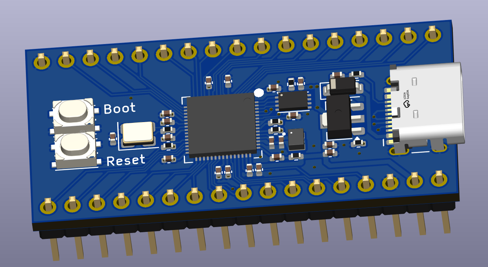
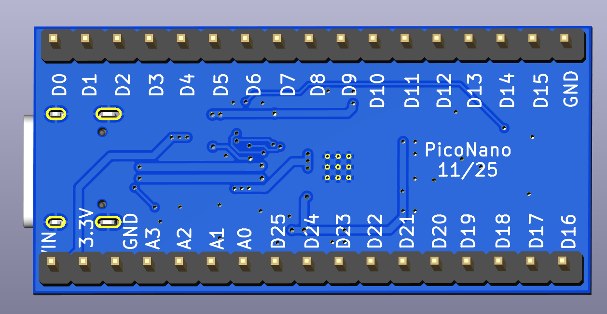
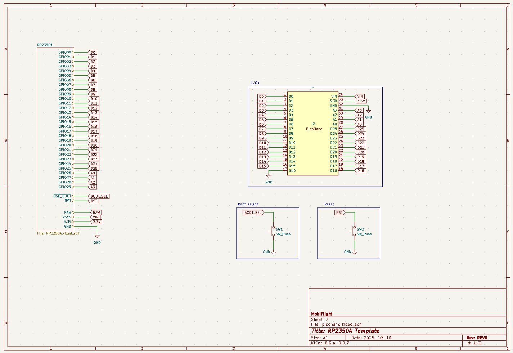
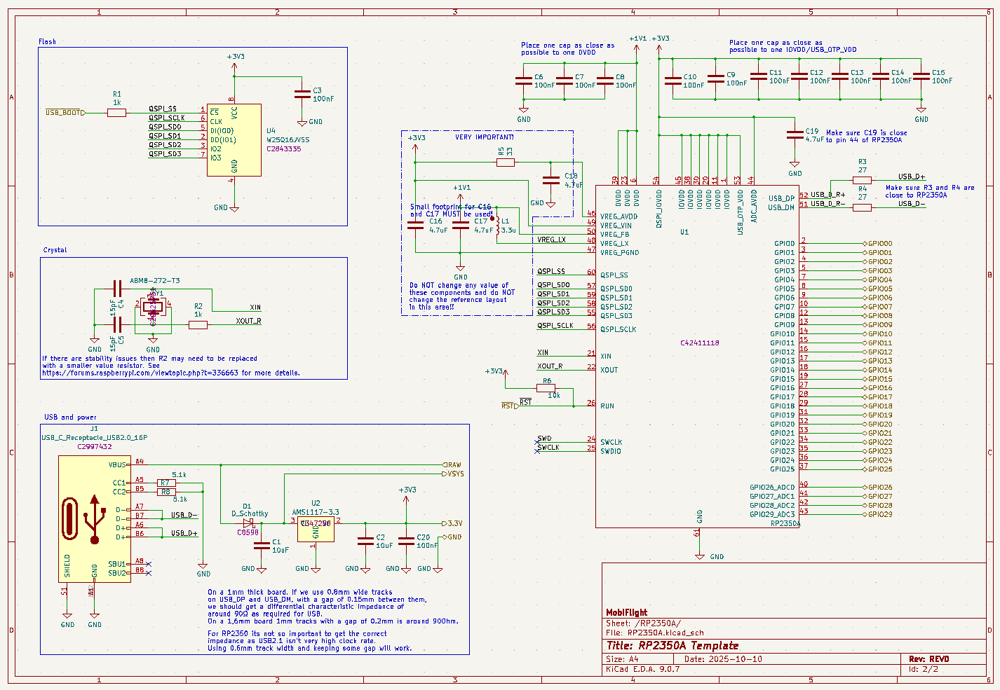

# 🧠 PicoNano (RP2350A)

The **PicoNano** is a compact RP2350A-based microcontroller board designed as a **modern drop-in alternative to the Arduino Nano**.  
It keeps the same small footprint while offering significantly more processing power, memory, and advanced features for modern projects.

This board is optimized especially for **Mobiflight custom devices**, cockpit electronics, displays, and I/O-intensive modules.

---

## 🚀 Key Advantages over Arduino Nano

| Feature | Arduino Nano | **PicoNano (RP2350A)** |
|---------|--------------|------------------------|
| MCU | ATmega328P (8-bit AVR) | RP2350A Dual-Core ARM Cortex-M33 |
| Clock Speed | 16 MHz | **up to 150 MHz** |
| Flash | 32 KB | **2 MB** |
| RAM | 2 KB | **520 KB** |
| USB | Mini-USB | **USB-C native** |
| Bootloader | Double-tap reset | **BOOTSEL button** |
| Logic Voltage | 5V | **3.3V with 5V-tolerant I/O** |
| Analog Inputs | 8 | 4 (A0–A3) |
| PWM | 6 | **16+** |
| Mobiflight | Supported | **Fully supported** |

---

## ⭐ Highlights

- **Massive performance boost** vs. Arduino Nano
- **Large memory**, ideal for displays and custom scripts
- **5V-tolerant GPIO**, ideal migration from Nano
- **USB-C + Boot button**
- **All pins available on dual header layout**
- Runs **Mobiflight, MicroPython, CircuitPython, C/C++**

---

## ⚡ Why PicoNano is ideal for Mobiflight custom devices

- More memory and speed for large device scripts
- Smooth handling of multiple **OLED** displays
- Great performance with **MAX7219 LED segments**
- Eliminates low-RAM crashes and slow rendering familiar on Nano

---

## ⚠ Compatibility Limitations

| Limitation | Detail |
|-----------|--------|
| Only 4 analog inputs | A0–A3 |
| 3.3V logic | 5V-tolerant input, but cannot drive high-current |
| External 5V recommended | for displays / LED drivers |
| Level shifting required for 5V logic devices | e.g. MAX7219 |

---

## 🔌 Example Wiring — MAX7219 with PicoNano (via Level Shifter)

**Signal connections**
| PicoNano Pin | MAX7219 |
|--------------|---------|
| Pin 22 | DIN |
| Pin 23 | CLK |
| Pin 24 | CS |
| Pin 25 | LOAD |

**Power**
| PicoNano / External | MAX7219 |
|---------------------|----------|
| 5V (Vin / USB 5V) | VCC |
| GND | GND (shared) |

---

## Important Notes

- Use a **BSS138-based bidirectional level shifter** (MAX7219 requires **5V logic**)
- MAX7219 must be powered from **5V**, not 3.3V
- Pins **22–25** are suited for level-shifted SPI routing
- Level shifters **cannot** supply high current → not suitable for LED strips, relays

---

## 📦 Summary

The **PicoNano** brings the Nano format into the modern age:
- Huge performance & memory improvement
- Ideal for Mobiflight custom devices
- Perfect for display-heavy avionics panels
- Fully breadboard friendly

---

## Additional information

### Bottom View

### Schematic

